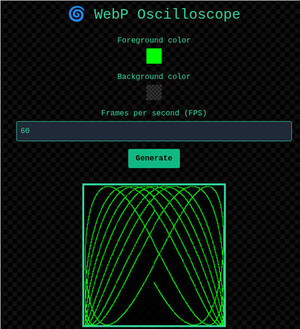

# Oscilloscope Go Server by [Eric Popelka](https://github.com/arickp)

This is a lightweight Go server that serves animated WebP waveforms, with customizable foreground and background colors. It's based on the sample program in the first chapter of _The Go Programming Language_ 
by Donovan and Kernighan. 

## 🚀 Features

- Customize waveform color 
- Creates transparent WebP files
- Supports full alpha transparency for WebP output (great for compositing)
- Configurable port via `PORT` environment variable. Default is 8000.
- Lightweight and fast — written in pure Go

---

## 📦 Requirements

- Go 1.24 or newer
- [ffmpeg](https://ffmpeg.org)
- Docker (optional)

---

## 🔧 Usage

### ▶️ Run the server

```bash
go run main.go
```

### 🏗️ Build the binary

```bash
go build -o oscilloscope-go-server main.go
```

Then run it:

```bash
./oscilloscope-go-server
```

---

## 🌐 Making a request

### Demo page:

```http
http://localhost:8000/
```

Visiting / in your browser loads a built-in demo UI served by the Go backend — a static HTML page with a color picker, frame control, and real-time preview.
The Go server serves a static HTML page with a color picker, frame control, and a real-time preview of the 
waveform. It uses JavaScript to call the /lissajous endpoint and render the generated animation.




You'll have to run the program (by making requests to the server) for the full, animated experience!

---

### API:

```http
http://localhost:8000/lissajous?fgColor=%23rrggbbaa&bgColor=%23rrggbbaa&frames=x
```

* `fgColor` and `bgColor` must be hex strings in the form `#rrggbbaa` (URL-encoded as `%23rrggbbaa`).
* Returns a response in `image/webp` format.

---

## 🧪 Dev Tips
- To run the test suite:

```bash
go test ./...
```

- You can build a Docker image and run it using these commands:

```bash
docker build --tag oscilloscope-go-server .
docker run -p 8000:8000 oscilloscope-go-server
```

- When calling the `/lissajous` endpoint, you can provide `random` as the value of
  `fgColor` and/or `bgColor`.

- Don’t forget to URL-encode `#` as `%23` when testing the API in the browser or curl/Postman.
  
