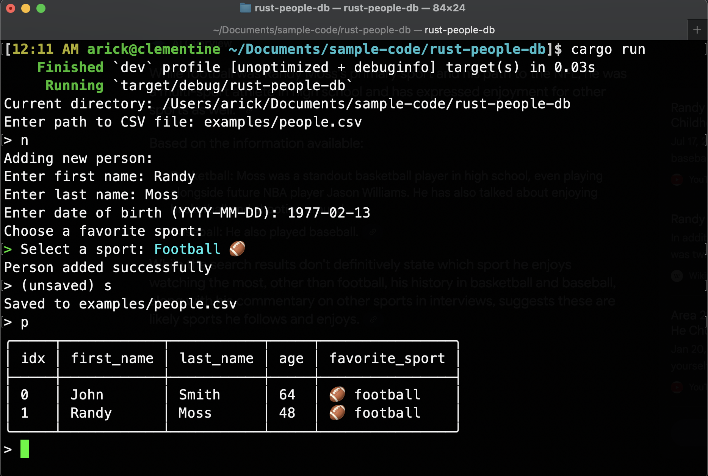

# rust-people-db

## Author

[Eric Popelka](https://github.com/arickp)

A simple Rust CLI tool to manage a database of people stored in a CSV file with an intuitive interactive interface.

## Interactive CLI Experience

Simply run the program and follow the interactive prompts to manage your people database:

```bash
cargo run -- people.csv
```

The interactive interface guides you through adding, editing, deleting, and viewing people records with a clean, user-friendly experience.



## Features

- **Interactive prompts** for all operations
- **Data validation** with helpful error messages
- **CSV file management** (creates file if it doesn't exist)
- **Structured data fields** including names, birth dates, and favorite sports
- **Edit and delete by index** for easy record management

## Getting Started

1. Clone this repository
2. Run `cargo run -- people.csv` to start the interactive interface
3. Follow the prompts to manage your people database

---

### Command Line Usage (Alternative)

For those who prefer direct command-line usage, you can also use specific commands:

```bash
# Add a new person
cargo run -- people.csv new --first-name John --last-name Smith --date-of-birth 1960-10-10 --favorite-sport football

# Other commands
cargo run -- people.csv print    # Show all people
cargo run -- people.csv edit     # Edit by index
cargo run -- people.csv delete   # Delete by index
cargo run -- --help             # Show help
```
