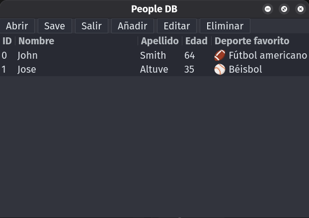

# rust-people-db

## Requirements

- **Rust**: Install using [rustup.rs](https://rustup.rs/) (recommended for all platforms)
- **GTK4 & Gettext**: Required for the GUI. Install as follows:
  - **Linux**: Use your package manager (e.g., `sudo apt install libgtk-4-dev gettext`) for Ubuntu/Debian.
  - **macOS**: Use Homebrew: `brew install gtk4 gettext`
  - **Windows**: Use [MSYS2](https://www.msys2.org/) and run:
    ```sh
    pacman -S mingw-w64-x86_64-gtk4 mingw-w64-x86_64-gettext
    ```
    - **Important:** You must use the GNU toolchain (`stable-x86_64-pc-windows-gnu`) with MSYS2. The MSVC toolchain is not supported for GTK4 Rust GUI development with MSYS2 libraries.
    - After installing Rust with rustup, set the default toolchain to GNU:
      ```sh
      rustup default stable-x86_64-pc-windows-gnu
      ```
    - All build commands should be run inside the `mingw64` shell in MSYS2. If you
     encounter build errors about missing `gettext` or GTK4, double-check that you 
     are in the correct shell, the packages above are installed, and you are using the GNU toolchain. Also try disabling your anti-virus software, as tools such as Malwarebytes may incorrectly identify the Rust build tools as malware. 

> **Not supported:** Chromebook and Raspbian are not supported, as they do not currently provide GTK4 packages.

- **VS Code Rust Development**: For best experience, install the [rust-analyzer](https://marketplace.visualstudio.com/items?itemName=rust-lang.rust-analyzer) extension. This is recommended in `.vscode/extensions.json`.

---

## Author

[Eric Popelka](https://github.com/arickp)

A simple Rust application to manage a database of people stored in a CSV file. Available in both CLI and GTK4 GUI interfaces with full internationalization support.

---

**Binaries:**
- `people-db-gtk`: Launches the GTK4 graphical interface
- `people-db`: Launches the interactive command-line interface (CLI)

---

## GTK4 GUI Interface (`people-db-gtk`)

The application includes a modern GTK4 graphical user interface with the following features:

- **Clean, intuitive interface** with menu-based navigation and international translations
- **Table view** displaying people with ID, name, age, and favorite sport columns
- **Add, Edit, Delete operations** with confirmation dialogs
- **File operations** (Open, Save, Exit) with file chooser dialogs
- **Sport selection** with emoji icons and dropdown menus



*The GTK interface shown in Spanish translation*

### Running the GUI

```bash
cargo run --bin people-db-gtk
# or, after building:
./target/debug/people-db-gtk
```

The GUI will prompt you to select a CSV file or create a new one if none exists.

## Interactive CLI Experience (`people-db`)

Simply run the program and follow the interactive prompts to manage your people database:

```bash
cargo run --bin people-db -- examples/people.csv
# or, after building:
./target/debug/people-db examples/people.csv
```

The interactive interface guides you through adding, editing, deleting, and viewing people records with a clean, user-friendly experience.

## Getting Started

1. Clone this repository
2. Choose your preferred interface:
   - **GUI**: Run `cargo run --bin people-db-gtk` for the GTK4 interface
   - **CLI**: Run `cargo run --bin people-db -- examples/people.csv` for the interactive CLI
3. Follow the prompts to manage your people database

---

### Command Line Usage (Alternative)

For those who prefer direct command-line usage, you can also use specific commands:

```bash
# Add a new person
cargo run --bin people-db -- examples/people.csv new --first-name John --last-name Smith --date-of-birth 1960-10-10 --favorite-sport football

# Other commands
cargo run --bin people-db -- examples/people.csv print    # Show all people
cargo run --bin people-db -- examples/people.csv edit     # Edit by index
cargo run --bin people-db -- examples/people.csv delete   # Delete by index
cargo run --bin people-db -- --help             # Show help
```
